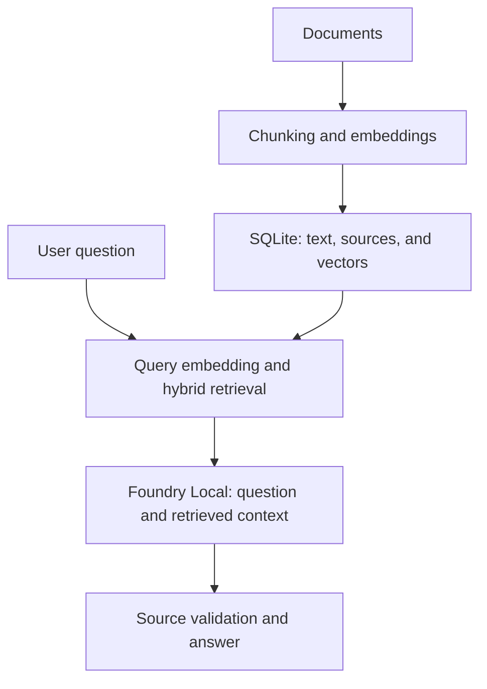

# Notlarım — Local RAG Assistant

**English** | [Türkçe](README.tr.md)

**Ask your documents. See the sources behind the answer.**

Notlarım is a local question-answering assistant for Turkish course notes and other text documents. It retrieves relevant passages, passes them to a language model running through Microsoft Foundry Local, and displays the sources alongside the answer.

Once dependencies and models are downloaded and setup is complete, the application can run without an internet connection. No cloud LLM API, API key, or Azure account is required.

[Setup](#setup) · [Usage](#usage) · [How it works](#how-it-works) · [Tests](#tests) · [Documentation](#documentation)

## Why Notlarım?

When looking up a concept in your notes, seeing where an answer comes from matters as much as the answer itself. Notlarım turns a small document collection into a searchable knowledge source and lets you inspect the original passages next to each response.

The repository includes **six Turkish Python study notes** to get started. You can also add your own TXT, Markdown, or text-based PDF documents. The sample content and interface are in Turkish.

## Features

- **Local inference:** Embeddings and answers are generated on your device using Foundry Local.
- **Document support:** Reads TXT, Markdown, and text-based PDFs, preserving PDF page references.
- **Hybrid retrieval:** Combines vector similarity with lexical search.
- **Source references:** Shows document names, pages, and retrieved passages.
- **Two answer modes:** Original source sentences or model-generated explanations.
- **Minimal interface:** Dark chat interface, document uploads, and JSON chat export.
- **Session cache:** Reuses answers for the same question and answer mode when the document index has not changed.
- **Command-line tools:** Supports indexing, search, chat, and evaluation.

## Technology

| Component | Technology |
|---|---|
| Application | Python |
| Model runtime | Microsoft Foundry Local SDK 2.0.1 |
| Chat model | Qwen2.5-7B |
| Embedding model | Qwen3-Embedding-0.6B · 1024 dimensions |
| Storage | SQLite |
| Retrieval | Cosine similarity + BM25 + Reciprocal Rank Fusion |
| Interface | Streamlit |
| PDF parsing | pypdf |

## Setup

### Prerequisites

These instructions cover **Windows with NVIDIA CUDA**.

Validated environment: Windows 11, Python **3.13.3**, **32 GB RAM**, and an **RTX 4070 Laptop GPU with 8 GB VRAM**. These describe the test machine, not minimum system requirements. macOS has not been validated.

Install Git and Python first. Initial dependency and model downloads require internet access. Model weights, the virtual environment, and the local database are not included in this repository.

### 1. Clone the repository and install dependencies

In PowerShell:

```powershell
git clone https://github.com/RaoufAlipour/local-rag-assistant.git
cd local-rag-assistant
py -3.13 -m venv .venv
.\.venv\Scripts\python.exe -m pip install -r requirements-ui.txt
.\.venv\Scripts\python.exe main.py doctor
```

You do not need to activate the virtual environment: these commands use its Python executable directly.

### 2. Prepare the models and offline catalog

Run this step **with internet access**:

```powershell
.\.venv\Scripts\python.exe main.py prepare --chat-model qwen2.5-7b --device cuda
.\.venv\Scripts\python.exe main.py snapshot --chat-model qwen2.5-7b --device cuda
```

`prepare` prepares the models and saves the device selection. `snapshot` saves the model metadata required for subsequent offline launches.

### 3. Index the sample documents

```powershell
.\.venv\Scripts\python.exe main.py ingest --offline
```

This processes documents in `data/documents/` and creates the local SQLite index.

### 4. Launch the application

```powershell
.\.venv\Scripts\python.exe ui.py
```

Open **http://127.0.0.1:8501** in your browser. The interface uses the local catalog and can run with Wi-Fi disabled once preparation is complete.

> For later sessions, just run `ui.py`. You do not need to download models or rebuild the index on every launch. The first question may take longer while the model loads.

## Usage

### Ask about your documents

Try these questions with the included Turkish Python notes:

- `break ile continue arasındaki fark nedir?` — What is the difference between break and continue?
- `print fonksiyonunun dönüş değeri nedir?` — What does the print function return?
- `Dosyayı a ve w modunda açmanın farkı nedir?` — What is the difference between opening a file in a and w modes?

Expand **Kaynaklar** (Sources) below the answer to inspect the document and retrieved passage. Each question is processed independently, so write a complete question instead of referring to earlier messages.

### Add your own documents

Use **Belgeler** (Documents) in the sidebar. The upload limit is **20 MB per file**. New documents are embedded during processing; unchanged documents are not reprocessed.

### Choose an answer mode

| Mode | Behavior |
|---|---|
| **Kaynak cümleleri** (Source sentences) — interface default | Displays original document sentences selected by the model. |
| **Model açıklaması** (Model explanation) | Generates a short explanation with source labels from the retrieved context. |

A citation alone does not prove that an answer is relevant or complete. Check the source passage when details matter.

### Use the command line

```powershell
.\.venv\Scripts\python.exe main.py ask "break ile continue farkı nedir?" --chat-model qwen2.5-7b --answer-mode extractive --offline
.\.venv\Scripts\python.exe main.py --help
```

## How it works

During ingestion, documents are split into chunks of approximately **180 words**, with a **30-word overlap**. Text, source metadata, and embeddings are stored in SQLite.

For each question, the same embedding model generates a query vector. The Python retrieval layer combines vector similarity and lexical matches to select up to three relevant chunks. The local chat model uses this context, and the application checks source identifiers before displaying the result.



## Tests

Run the infrastructure tests without downloading models:

```powershell
.\.venv\Scripts\python.exe -m unittest discover -s tests -v
```

Tests cover document processing, index updates, retrieval, source validation, caching, and interface flows. Passing automated tests does not mean the language model answers every question correctly.

To evaluate real answers using prepared models:

```powershell
.\.venv\Scripts\python.exe main.py evaluate --chat-model qwen2.5-7b --answer-mode extractive --offline --output storage/evaluation-results.json
```

Raw experiment records and reviews are available under [docs/evidence/](docs/evidence/). They cover different versions and runs and should not be combined into a single current accuracy score.

## Known limitations

- **Response times vary.** Initial loading and new questions can take time; the application does not consistently meet a 1–3 second response target. Caching only accelerates repeated questions.
- **No OCR.** Scanned PDFs must first be converted to text.
- **No conversational memory.** Chat history is displayed but is not included in the context of subsequent questions.
- **Answers can be imperfect.** Selected sources may be incomplete or irrelevant, and scope filters can reject valid questions.
- **Deleting a file does not clean the index.** Records for documents removed from the folder are not automatically deleted.
- **Offline mode is not a firewall.** It uses a local catalog but does not block network access at the operating-system level.

## Project structure

| Path | Contents |
|---|---|
| `app.py` / `ui.py` | Streamlit interface and launcher |
| `main.py` | Command-line entry point |
| `ragapp/` | Document processing, retrieval, model integration, and source checks |
| `data/documents/` | Sample Python notes |
| `tests/` | Automated tests |
| `scripts/` | Diagnostics and model comparison tools |
| `docs/` | Technical notes and experiment records |
| `teslim/` | Report, presentation, and demo guide |
| `storage/` | Runtime-generated local data; excluded from Git |

## Documentation

The supporting project documentation is primarily in Turkish.

- [Architecture and implementation decisions](docs/ARCHITECTURE.md)
- [Offline catalog](docs/OFFLINE-CATALOG.md)
- [Source sentence approach](docs/SOURCE-FAITHFUL-ANSWERS.md)
- [Quality evaluation](docs/WINDOWS-QUALITY-V3-REVIEW.md)
- [Performance experiments](docs/SPEED-RESULTS.md)
- [Project report](teslim/proje-raporu.pdf) · [Presentation](teslim/proje-sunumu.pptx) · [Demo guide](teslim/DEMO.md)

Some reports document earlier development stages and reflect the results of the version reviewed at that time.

## References

- [Microsoft Foundry Local SDK and examples](https://github.com/microsoft/Foundry-Local)
- [SQLite documentation](https://www.sqlite.org/docs.html)
- [Streamlit documentation](https://docs.streamlit.io/)

---

This project is an academic prototype built to explore local RAG architecture through practical implementation.
