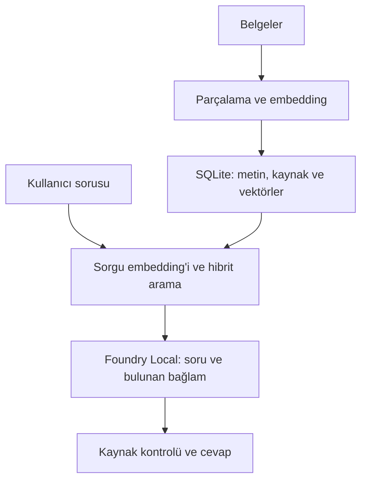

# Notlarım — Local RAG Assistant

[English](README.md) | **Türkçe**

**Belgelerine sor. Cevabı kaynağıyla birlikte gör.**

Notlarım, Türkçe ders notları ve diğer metin belgeleri üzerinde çalışan yerel bir soru-cevap asistanıdır. İlgili metin parçalarını bulur, Microsoft Foundry Local üzerinde çalışan bir dil modeline iletir ve cevabın kaynaklarını gösterir.

İlk kurulum ve model indirmeleri tamamlandıktan sonra internet bağlantısı olmadan kullanılabilir. Bulut LLM API’si, API anahtarı veya Azure hesabı gerektirmez.

[Kurulum](#kurulum) · [Kullanım](#kullanım) · [Nasıl çalışır?](#nasıl-çalışır) · [Testler](#testler) · [Dokümantasyon](#dokümantasyon)

## Neden Notlarım?

Ders notlarında bir kavramı ararken yalnızca bir cevap almak değil, cevabın hangi belgeye dayandığını görmek de önemlidir. Notlarım, küçük bir belge koleksiyonunu aranabilir bir bilgi kaynağına dönüştürür ve kaynak metnini cevabın yanında incelemeyi sağlar.

Depo, başlangıç için **altı Türkçe Python notu** içerir. Kendi TXT, Markdown veya metin içeren PDF belgelerini de ekleyebilirsin.

## Özellikler

- **Yerel çalışma:** Embedding ve cevap üretimi Foundry Local ile cihaz üzerinde gerçekleşir.
- **Belge desteği:** TXT, Markdown ve metin içeren PDF dosyalarını okur; PDF sayfa bilgisini korur.
- **Hibrit arama:** Vektör benzerliğini sözcük tabanlı aramayla birleştirir.
- **Kaynaklı cevaplar:** Belge adını, sayfayı ve getirilen kaynak metnini gösterir.
- **İki cevap biçimi:** Özgün kaynak cümleleri veya modelin oluşturduğu açıklama.
- **Minimal arayüz:** Koyu temalı sohbet, belge yükleme ve JSON sohbet indirme.
- **Oturum önbelleği:** Aynı soru ve cevap modu için, belge indeksi değişmediyse önceki cevabı kullanır.
- **Terminal desteği:** İndeksleme, arama, sohbet ve değerlendirme komutları sunar.

## Teknolojiler

| Bileşen | Kullanılan teknoloji |
|---|---|
| Uygulama | Python |
| Model çalıştırma | Microsoft Foundry Local SDK 2.0.1 |
| Sohbet modeli | Qwen2.5-7B |
| Embedding modeli | Qwen3-Embedding-0.6B · 1024 boyut |
| Veri deposu | SQLite |
| Arama | Cosine similarity + BM25 + Reciprocal Rank Fusion |
| Arayüz | Streamlit |
| PDF okuma | pypdf |

## Kurulum

### Gereksinimler

Aşağıdaki adımlar **Windows ve NVIDIA CUDA** kurulumu içindir.

Doğrulanan cihaz: Windows 11, Python **3.13.3**, **32 GB RAM** ve **RTX 4070 Laptop GPU / 8 GB VRAM**. Bu bilgiler test ortamını belirtir; minimum sistem gereksinimi değildir. macOS üzerinde doğrulama yapılmadı.

Git ve Python kurulu olmalı. Bağımlılık ve model indirmeleri için ilk kurulumda internet gerekir. Model ağırlıkları, sanal ortam ve yerel veritabanı bu depoya dahil değildir.

### 1. Projeyi indir ve bağımlılıkları kur

PowerShell’de:

```powershell
git clone https://github.com/RaoufAlipour/local-rag-assistant.git
cd local-rag-assistant
py -3.13 -m venv .venv
.\.venv\Scripts\python.exe -m pip install -r requirements-ui.txt
.\.venv\Scripts\python.exe main.py doctor
```

Sanal ortamı etkinleştirmek gerekmez; komutlar doğrudan bu ortamın Python’unu kullanır.

### 2. Modelleri ve çevrimdışı kataloğu hazırla

Bu adımı **internet açıkken** çalıştır:

```powershell
.\.venv\Scripts\python.exe main.py prepare --chat-model qwen2.5-7b --device cuda
.\.venv\Scripts\python.exe main.py snapshot --chat-model qwen2.5-7b --device cuda
```

`prepare`, modelleri hazırlar ve cihaz seçimini kaydeder. `snapshot`, sonraki çevrimdışı açılışlarda gereken model bilgilerini saklar.

### 3. Örnek belgeleri indeksle

```powershell
.\.venv\Scripts\python.exe main.py ingest --offline
```

`data/documents/` içindeki belgeler işlenir ve yerel SQLite indeksi oluşturulur.

### 4. Uygulamayı aç

```powershell
.\.venv\Scripts\python.exe ui.py
```

Tarayıcıda **http://127.0.0.1:8501** adresini aç. Arayüz yerel kataloğu kullanır; hazırlık tamamlandıysa Wi-Fi kapalıyken de çalışabilir.

> Sonraki kullanımlarda yalnızca `ui.py` komutunu çalıştırman yeterli. Her açılışta model indirme veya yeniden indeksleme gerekmez. İlk soru, model yüklenirken daha uzun sürebilir.

## Kullanım

### Belgelerine soru sor

Örnek Python notlarıyla şunları deneyebilirsin:

- `break ile continue arasındaki fark nedir?`
- `print fonksiyonunun dönüş değeri nedir?`
- `Dosyayı a ve w modunda açmanın farkı nedir?`

Cevabın altındaki **Kaynaklar** bölümünü açarak belgeyi ve kullanılan metin parçasını incele. Her soru bağımsız işlenir; önceki mesajlara gönderme yapmak yerine soruyu açıkça yaz.

### Kendi belgelerini ekle

Sol menüdeki **Belgeler** ekranını kullan. Dosya başına sınır **20 MB**’dır. Yeni belgeler işlenirken embedding’leri oluşturulur; değişmeyen belgeler yeniden işlenmez.

### Cevap biçimini seç

| Mod | Davranış |
|---|---|
| **Kaynak cümleleri** — arayüz varsayılanı | Modelin seçtiği özgün belge cümlelerini gösterir. |
| **Model açıklaması** | Getirilen bağlamdan kısa, kaynak etiketli bir açıklama üretir. |

Kaynak göstermek, cevabın ilgili veya yeterli olduğunu tek başına kanıtlamaz. Özellikle önemli ayrıntılarda kaynak metnini kontrol et.

### Terminalden kullan

```powershell
.\.venv\Scripts\python.exe main.py ask "break ile continue farkı nedir?" --chat-model qwen2.5-7b --answer-mode extractive --offline
.\.venv\Scripts\python.exe main.py --help
```

## Nasıl çalışır?

Belge hazırlama sırasında metinler yaklaşık **180 kelimelik**, **30 kelime örtüşmeli** parçalara ayrılır. Metinler, kaynak bilgileri ve embedding’ler SQLite’a kaydedilir.

Soru geldiğinde aynı embedding modeliyle sorgu vektörü üretilir. Python katmanı vektör benzerliğini ve sözcük eşleşmelerini birleştirerek en fazla üç ilgili parçayı seçer. Yerel sohbet modeli bu bağlamı kullanır; uygulama kaynak kimliklerini doğrulayıp sonucu gösterir.



## Testler

Model indirmeden altyapı testlerini çalıştır:

```powershell
.\.venv\Scripts\python.exe -m unittest discover -s tests -v
```

Testler; belge işleme, indeks güncelleme, arama, kaynak denetimi, önbellek ve arayüz akışlarını kapsar. Otomatik testlerin geçmesi, dil modelinin bütün sorulara doğru cevap verdiği anlamına gelmez.

Mevcut modellerle gerçek cevapları değerlendirmek için:

```powershell
.\.venv\Scripts\python.exe main.py evaluate --chat-model qwen2.5-7b --answer-mode extractive --offline --output storage/evaluation-results.json
```

Ham deney kayıtları ve incelemeler [docs/evidence/](docs/evidence/) altında bulunur. Bunlar farklı sürüm ve koşumlara aittir; tek bir güncel doğruluk oranı olarak birleştirilmemelidir.

## Bilinen sınırlar

- **Yanıt süresi değişkendir.** İlk yükleme ve yeni sorular uzun sürebilir; her soruda 1–3 saniye hedefi sağlanmıyor. Önbellek yalnız tekrar soruları hızlandırır.
- **OCR yoktur.** Taranmış PDF’ler önce metne dönüştürülmelidir.
- **Sohbet belleği yoktur.** Geçmiş ekranda görünür, ancak sonraki sorunun bağlamına eklenmez.
- **Kalite kusursuz değildir.** Kaynak seçimi eksik veya ilgisiz olabilir; kapsam filtreleri bazen doğru soruları reddedebilir.
- **Dosya silmek indeksi temizlemez.** Klasörden kaldırılan bir belgenin kayıtları otomatik silinmez.
- **Çevrimdışı mod bir güvenlik duvarı değildir.** Yerel kataloğu kullanır; işletim sistemi düzeyinde ağ engellemesi yapmaz.

## Proje yapısı

| Yol | İçerik |
|---|---|
| `app.py` / `ui.py` | Streamlit arayüzü ve başlatıcı |
| `main.py` | Komut satırı giriş noktası |
| `ragapp/` | Belge işleme, arama, model bağlantısı ve kaynak kontrolleri |
| `data/documents/` | Örnek Python notları |
| `tests/` | Otomatik testler |
| `scripts/` | Tanılama ve model karşılaştırma araçları |
| `docs/` | Teknik açıklamalar ve deney kayıtları |
| `teslim/` | Rapor, sunum ve demo rehberi |
| `storage/` | Çalışırken oluşturulan yerel veriler; Git tarafından dışlanır |

## Dokümantasyon

- [Mimari ve uygulama kararları](docs/ARCHITECTURE.md)
- [Çevrimdışı katalog](docs/OFFLINE-CATALOG.md)
- [Kaynak cümlesi yaklaşımı](docs/SOURCE-FAITHFUL-ANSWERS.md)
- [Kalite değerlendirmesi](docs/WINDOWS-QUALITY-V3-REVIEW.md)
- [Performans deneyleri](docs/SPEED-RESULTS.md)
- [Proje raporu](teslim/proje-raporu.pdf) · [Sunum](teslim/proje-sunumu.pptx) · [Demo rehberi](teslim/DEMO.md)

Bazı raporlar geliştirme sürecinin önceki aşamalarını belgeler; hazırlandıkları sürümün sonuçlarını yansıtır.

## Kaynaklar

- [Microsoft Foundry Local SDK ve örnekler](https://github.com/microsoft/Foundry-Local)
- [SQLite dokümantasyonu](https://www.sqlite.org/docs.html)
- [Streamlit dokümantasyonu](https://docs.streamlit.io/)

---

Bu proje, yerel RAG mimarisini uygulamalı olarak öğrenmek amacıyla geliştirilmiş bir akademik prototiptir.
